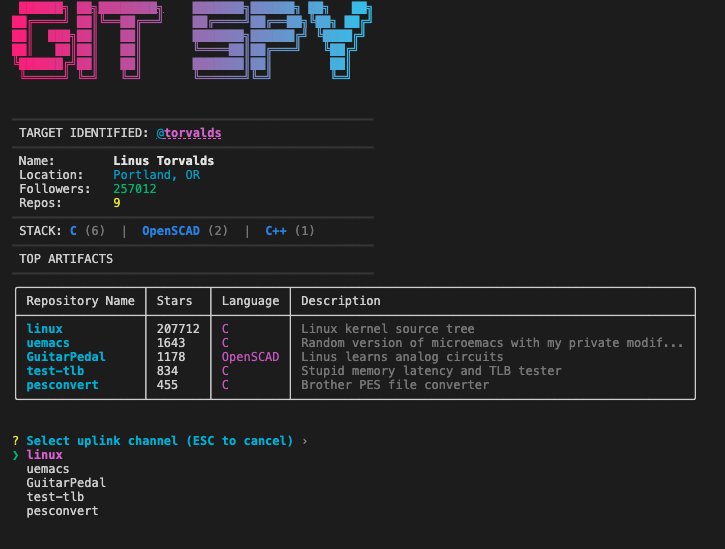

# GIT SPY // NEURAL INTERFACE

[](https://www.rust-lang.org/) [](LICENSE) [](https://github.com/lukasmetzler/git-spy/actions)

**Git Spy** is a high-fidelity command-line tool designed to interface with the GitHub network. Built in Rust, it extracts user data, analyzes repository statistics, and visualizes the information through a neon-soaked, cyberpunk-inspired terminal interface.

## Interface Preview



## System Capabilities

**Profile Analysis**
Retrieves and displays comprehensive profile data including bio, location, follower count, and public repository metrics with strictly aligned formatting.

**Stack Analysis**
Algorithmic breakdown of dominant programming languages across the target's repositories. Visualized via color-coded text for rapid assessment.

**Visual Fidelity**
Features a custom RGB-interpolated banner rendering ("ANSI Shadow" typeface) and a neon color palette designed for high-contrast terminals.

**Secure Uplink**
Integrated interactive menu system allowing immediate browser connection to specific repositories without leaving the terminal environment.

## Usage

Initiate a scan by providing a target username.

```bash
git-spy --user <USERNAME>
```

### Command Line Arguments

| Argument    | Flag              | Description                                       |
| :---------- | :---------------- | :------------------------------------------------ |
| **User**    | `-u`, `--user`    | The target GitHub username to analyze (Required). |
| **Help**    | `-h`, `--help`    | Displays system manual and options.               |
| **Version** | `-V`, `--version` | Displays current build version.                   |

### Example

```bash
# Analyze the creator of Linux
git-spy -u torvalds
```

## Installation Protocols

### Method A: Pre-compiled Binary (Recommended)

Navigate to the [Releases Page](https://github.com/lukasmetzler/git-spy/releases). Download the appropriate executable for your architecture (Windows, Linux, or macOS) and execute it directly from your terminal. No dependencies required.

### Method B: Compile from Source

Ensure a valid Rust toolchain is installed on your local machine.

1.  **Clone the repository:**

    ```bash
    git clone [https://github.com/lukasmetzler/git-spy.git](https://github.com/lukasmetzler/git-spy.git)
    cd git-spy
    ```

2.  **Compile release build:**

    ```bash
    cargo build --release
    ```

3.  **Execute:**

    ```bash
    ./target/release/git-spy --user lukasmetzler
    ```

## Technical Stack

This system is engineered using the following crates:

- **Tokio:** Asynchronous runtime for non-blocking I/O.
- **Reqwest:** HTTP client for API communication.
- **Clap:** Command Line Argument Parser.
- **Tabled:** ANSI-compatible table formatting.
- **Indicatif:** Progress reporting and spinners.
- **Dialoguer:** Interactive terminal menus.
- **Figlet-rs:** ASCII art generation.

---

[License: MIT](https://www.google.com/search?q=LICENSE) | [Report Issue](https://www.google.com/search?q=https://github.com/lukasmetzler/git-spy/issues)
